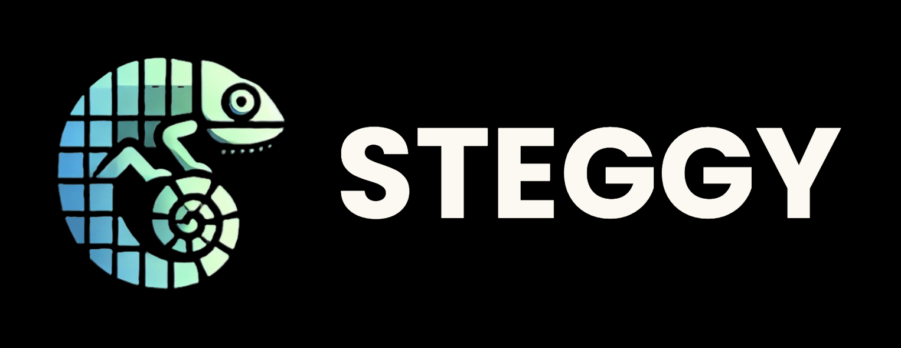

<div id="top">
<div align="left">


# STEGGY: One Stop Steganography and Forensic Website.



Steggy is a lightweight, multi-feature steganography and digital forensics web application built for researchers, students, and cybersecurity enthusiasts. It integrates popular tools under one intuitive web interface to detect, extract, and analyze hidden data in various file formats.


---

## Table of Contents

- [Motivation](#motivation)
- [Getting Started](#getting-started)
    - [Prerequisites](#prerequisites)
    - [Installation](#installation)
    - [Usage](#usage)
    - [Testing](#testing)
- [Features](#features)
- [Contributing](#contributing)
- [Authors](#authors)

---

## Motivation

As Cyber Security students, we recognize the growing digital trust crisis in Indonesia—marked by frequent account breaches, data leaks, and the uncontrolled spread of personal information. This alarming reality motivated us to develop Steggy, a web-based platform that empowers users to securely conceal sensitive messages within digital media such as images, audio, and video.

By combining steganography and cryptography, Steggy ensures that hidden messages are not only invisible but also protected from unauthorized access. With no installation required, no storage limits, and a user-friendly interface, Steggy aims to be a practical, accessible tool that raises cybersecurity awareness and serves as an educational resource for digital forensics enthusiasts and CTF communities.

---

## Getting Started

### Prerequisites

This project requires the following dependencies:

- **Front End:** HTML, CSS, JavaScript
- **Back End:** Python(Flask)
- **Tools Integrated:** steghide, stegoveritas, pdf-parser, exiftool, foremost, ffmpeg, matplotlib, PIL
- **Container Runtime:** Docker

### Installation

Build Steggy from the source and install dependencies:

1. **Clone the repository:**

    ```sh
    ❯ git clone https://github.com/unknownman77/Steggy
    ```

2. **Navigate to the project directory:**

    ```sh
    ❯ cd Steggy
    ```

3. **Install the dependencies:**

**Using [docker](https://www.docker.com/):**

```sh
❯ pip install -r requirement.txt
```

### Usage

Run the project with:

**Using [docker](https://www.docker.com/):**

```sh
❯ chmod +x run.sh
```

For Mac User:

```sh
❯ xattr -d com.apple.quarantine run.sh
```

Run the bash:

```sh
❯ ./run.sh
```

---

## Contributing

- **💬 [Join the Discussions](https://github.com/unknownman77/Steggy/discussions)**: Share your insights, provide feedback, or ask questions.
- **🐛 [Report Issues](https://github.com/unknownman77/Steggy/issues)**: Submit bugs found or log feature requests for the `Steggy` project.
- **💡 [Submit Pull Requests](https://github.com/unknownman77/Steggy/blob/main/CONTRIBUTING.md)**: Review open PRs, and submit your own PRs.

<details closed>
<summary>Contributing Guidelines</summary>

1. **Fork the Repository**: Start by forking the project repository to your github account.
2. **Clone Locally**: Clone the forked repository to your local machine using a git client.
   ```sh
   git clone https://github.com/unknownman77/Steggy
   ```
3. **Create a New Branch**: Always work on a new branch, giving it a descriptive name.
   ```sh
   git checkout -b new-feature-x
   ```
4. **Make Your Changes**: Develop and test your changes locally.
5. **Commit Your Changes**: Commit with a clear message describing your updates.
   ```sh
   git commit -m 'Implemented new feature x.'
   ```
6. **Push to github**: Push the changes to your forked repository.
   ```sh
   git push origin new-feature-x
   ```
7. **Submit a Pull Request**: Create a PR against the original project repository. Clearly describe the changes and their motivations.
8. **Review**: Once your PR is reviewed and approved, it will be merged into the main branch. Congratulations on your contribution!
</details>

<details closed>
<summary>Contributor Graph</summary>
<br>
<p align="left">
   <a href="https://github.com{/unknownman77/Steggy/}graphs/contributors">
      
   </a>
</p>
</details>

---

## Authors

Thank you very much to these awesome people:
- [unknownman77](https://github.com/unknownman77)
- [hazy](https://github.com/hazy0189)
- [notCarrot](https://github.com/0xjnz)
- [SushiMaker1](https://github.com/SushiMaker1)


<div align="left"><a href="#top">⬆ Return</a></div>

---
